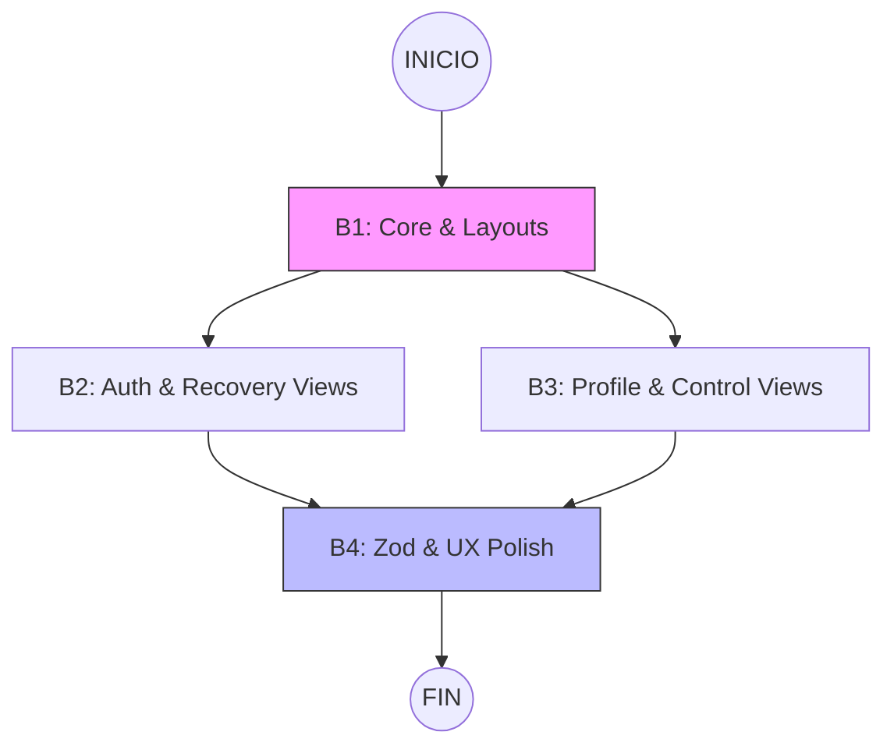

# Plan de Implementación — Mockups Visuales y UX (f1_1.1)

> Trazabilidad: Este plan ejecuta `docs/f1_1.1/f1_1.1_prd.md` según el diseño de `docs/f1_1.1/f1_1.1_spec.md`.

## 1. Resumen del Plan
El objetivo de esta etapa es implementar el prototipo funcional de alta fidelidad para el sistema **SimpleAuth**. Se construirán las 11 vistas requeridas utilizando **Next.js App Router**, **Tailwind CSS** para el diseño "The Intelligent Monolith", y **Zod** para la validación de contratos de datos. La estrategia se basa en centralizar primero los Layouts y Componentes Base para asegurar la consistencia del Glassmorphism antes de desplegar la lógica interactiva.

**Hitos clave**:
- H1: Base UI y Sistema de Layouts (B1).
- H2: Implementación de Vistas de Autenticación y Verificación (B2).
- H3: Vistas de Perfil, Seguridad y Baja (B3).
- H4: Capa de Lógica Interactiva, Micro-animaciones y Zod (B4).

## 2. Ruta Crítica

### 2.1 Diagrama de Dependencias

### 2.2 Análisis de Ruta Crítica
| Bloque | Duración Est. | Dependencias | En Ruta Crítica |
|---|---|---|---|
| **B1: Foundation** | 1 día | Ninguna | ✅ SÍ |
| **B2: Auth UI** | 1 día | B1 | ✅ SÍ |
| **B3: Profile UI** | 1 día | B1 | ❌ NO (Paralelo a B2) |
| **B4: UX & Logic** | 1.5 días | B2, B3 | ✅ SÍ |

**Tiempo Mínimo de Ejecución**: 3.5 días (asumiendo paralelismo total entre B2 y B3).

## 3. Backlog de Trabajo (WBS)

### B1 — Foundation & Shared UI Components
- **Objetivo**: Establecer los tokens de diseño y los contenedores estructurales (Layouts).
- **Componentes [ARC] relacionados**: `AuthLayout`, `AppLayout`, `GlassCard`, `Header`.
- **Requerimientos que implementa**: CC-001 (Temas), FR-1.1.6.
- **Entregables**:
  - `app/layout.tsx` (Theme Provider).
  - `components/layouts/AuthLayout.tsx`, `components/layouts/AppLayout.tsx`.
  - `components/ui/GlassCard.tsx`, `components/ui/StatusCard.tsx`.
  - `globals.css` (Tokens HSL, Gradients).
  - **Mock Auth Provider**: Implementación de un contexto/flag simple (`isMockAuthenticated`) para habilitar la navegación hacia `AppLayout` sin backend.
  - **Assets**: Generación de Brand Assets (Logo, Favicon) via AI. *Note: En caso de que la IA no cumpla el estándar Premium, se usará el set de iconos de respaldo (Lucide/Phosphor) para no bloquear el hito.*
- **Duración estimada**: 1 día
- **Dependencias**: Ninguna
- **Hito de aceptación**:
  - [ ] El cambio de tema (Dark/Light) funciona sin FOUC.
  - [ ] El efecto Glassmorphism se visualiza correctamente en `GlassCard`.
  - [ ] **Assets AI**: El logo y favicon generados están integrados y visibles en el Header/Pestaña del navegador (No placeholders).

### B2 — Auth & Recovery Views Flow
- **Objetivo**: Crear las rutas y maquetación de los flujos públicos de autenticación.
- **Requerimientos**: FR-1.1.1, FR-1.1.2, FR-1.1.4, FR-1.1.8.
- **Entregables**:
  - `/auth/register`, `/auth/login`.
  - `/auth/recovery`, `/auth/reset-password`.
  - `/auth/verify-sent`.
  - `/auth/verify-result` (Manejo de estados Success/Error según SPEC).
  - `/auth/logout` (Lógica de limpieza de tokens/sesión y redirección).
- **Duración estimada**: 1 día
- **Dependencias**: B1
- **Hito de aceptación**:
  - [ ] Navegación funcional entre Login, Registro y Recuperación.
  - [ ] La ruta `/auth/verify-result?status=error` muestra el botón de reenvío según SPEC.

### B3 — Profile & Control Views
- **Objetivo**: Crear las rutas y maquetación para la administración de cuenta y seguridad.
- **Requerimientos**: FR-1.1.3, FR-1.1.7, FR-1.1.9.
- **Entregables**:
  - `/profile` (Editor).
  - `/profile/security` (Cambio de contraseña).
  - `/profile/delete` (Confirmación de baja).
  - `/auth/blocked` (Estado de Rate Limit).
- **Duración estimada**: 1 día
- **Dependencias**: B1
- **Hito de aceptación**:
  - [ ] El Editor de Perfil incluye todos los campos del PRD (País, Género, birth_date).
  - [ ] La pantalla de Bloqueo informa los 15 minutos de espera.

### B4 — Zod Validations & UX Polish
- **Objetivo**: Aplicar la inteligencia de validación y refinamiento visual premium.
- **Requerimientos**: CC-002, FR-1.1.1 (Security Checklist), NFR-1.1.1.
- **Entregables**:
  - Definición de 7 esquemas Zod en `lib/validations.ts`.
  - Animaciones de página con `Framer Motion`.
  - Feedback de Logout (Toasts).
  - **Checklist dinámico** de requisitos de contraseña en el Registro (según SPEC G-04).
  - **Mapping de Errores UX**: Implementación de lógica en `StatusCard` para diferenciar "Expirado" vs "Inválido" bajo `?status=error` (según SPEC G-05).
  - **Test Setup**: Creación de la estructura base de carpetas `tests/unit/` y `tests/e2e/`, configuración de Playwright y del entorno de ejecución.
- **Duración estimada**: 1.5 días (Aumentado por E2E)
- **Dependencias**: B2, B3
- **Hito de aceptación**:
  - [ ] El formulario de registro bloquea el avance si la fecha de nacimiento (`birth_date`) indica < 18 años.
  - [ ] Las transiciones de página son suaves y premium.
  - [ ] Todos los formularios muestran estado `loading/submitting`.
  - [ ] **Resolución G-05**: Al visitar `/auth/verify-result?status=error&type=expired` se visualiza el mensaje específico de expiración.

## 4. Estrategia de Pruebas
| Tipo | Alcance | Archivo/Ruta | Criterio de Éxito | Bloque |
|---|---|---|---|---|
| **Uni (Zod)** | Esquemas de datos | `tests/unit/schemas.test.ts` | 7 esquemas validan tipos y constraints (8+ carac, birth_date 18+) | B4 |
| **Nav (E2E)** | Flujos y Rutas | `tests/e2e/navigation.spec.ts` | El "Happy Path" y las 11 rutas cargan correctamente en Playwright | B4 |
| **UI (Visual)** | Responsividad | `browsers/mobile_desktop` | UI legible y funcional en 360px y 1920px | B4 |

## 5. Definition of Done (DoD)
La etapa se considera completada cuando:
- [ ] La UI corresponde 1:1 con la SPEC v1.3.0 y los requerimientos visuales del PRD.
- [ ] Los 7 esquemas Zod están implementados y validados.
- [ ] El sistema de temas (Dark/Light) es persistente y premium.
- [ ] Suite de pruebas unitarias y E2E (Navegación) pasa al 100%.
- [ ] Commit atómico creado en la rama `feat/f1_1.1_setup`.
- [ ] Documentación técnica de rutas actualizada en la SPEC (Sección 3).
