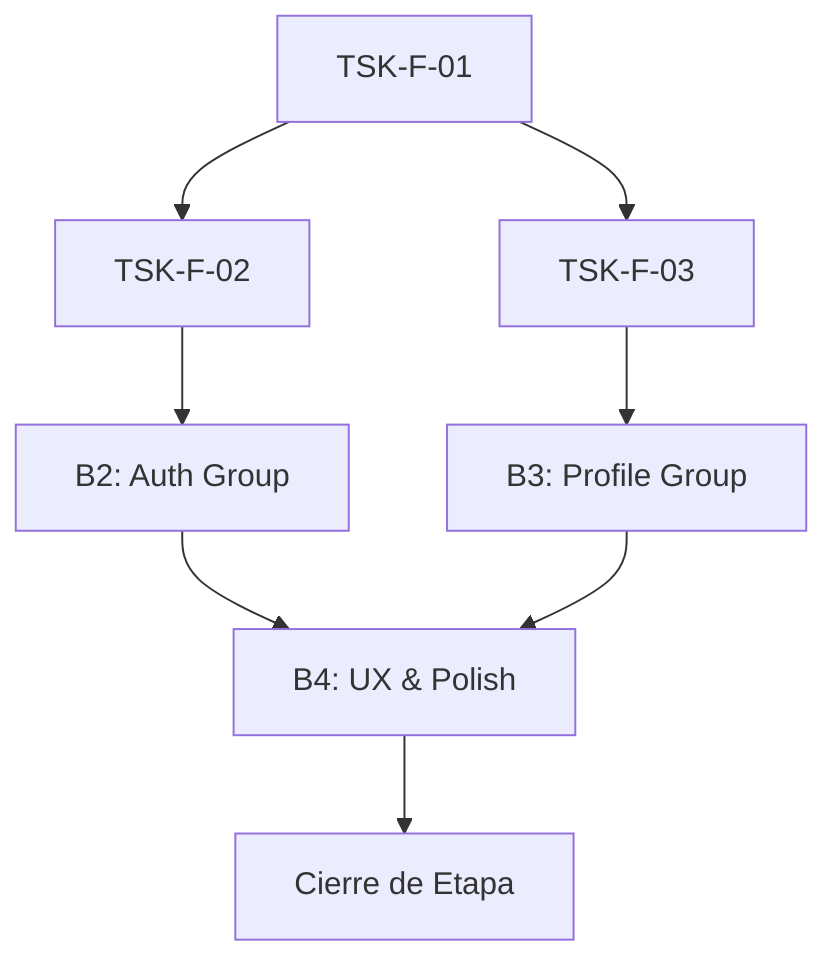

# Lista de Tareas — Mockups Visuales y UX (f1_1.1)

> Trazabilidad: Estas tareas implementan `docs/f1_1.1/f1_1.1_plan.md`.
> Actualiza marcando `[x]` al completar. **NUNCA borres tareas completadas.**

## Mapa de Dependencias

## Bloque 1 — Foundation & Shared UI Components
- [x] `[TSK-F-01]` Configurar `globals.css` con tokens HSL, gradientes premium y animaciones base.
  - **Agente responsable**: `frontend-coder` (Ejecución)
  - **DoD**: Tokens HSL definidos y gradiente "Intelligent Monolith" funcional.

- [x] `[TSK-F-02.1]` Implementar componente `GlassCard` (efecto glassmorphism).
  - **Agente responsable**: `frontend-coder` (Ejecución)
  - **DoD**: Renderiza correctamente con props de transparencia.

- [x] `[TSK-F-02.2]` Implementar componente `StatusCard` con soporte para `ResendButton`.
  - **Agente responsable**: `frontend-coder` (Ejecución)
  - **DoD**: Soporta estados Success/Error y acciones condicionales.

- [x] `[TSK-F-03.1]` Crear `AuthLayout` (Header simplificado/Logo).
  - **Agente responsable**: `frontend-coder` (Ejecución)
  - **DoD**: Layout base para login/registro centrado.

- [x] `[TSK-F-03.2]` Crear `AppLayout` (Navegación principal).
  - **Agente responsable**: `frontend-coder` (Ejecución)
  - **DoD**: Sidebar/Header funcional para vistas de perfil.

- [x] `[TSK-F-04]` Generación de Assets AI (Logo/Favicon).
  - **Agente responsable**: `frontend-coder` (Ejecución)
  - **DoD**: Assets integrados en `/public`. Incluye hito "Go/No-Go": si la IA no genera assets premium en < 3 iteraciones, usar set de iconos Lucide como fallback (G-11).
  - **Nota**: G-11 activado — fallback SVG artesanal implementado por ausencia de generación AI en entorno de ejecución. `logo.svg` (40×40) y `favicon.svg` (32×32) con escudo geométrico + checkmark + gradiente `#005eb6 → #5f9efb`. Integrados en `AuthLayout`, `AppLayout` y metadata de `layout.tsx`. Build: ✅ sin errores.

- [x] `[TSK-F-R1]` **Auditoría UI/UX Base**: Revisar consistencia de `GlassCard`, Layouts y Assets.
  - **Agente responsable**: `ui-consistency-manager` (Revisión)
  - **DoD**: Informe de conformidad visual y validación de estética "Premium".
  - **Nota**: Auditoría completada. BLQ-H-01 resuelto por el orquestador (2026-04-03). Token `UI_CONSISTENTE` emitido. Ver `docs/f1_1.1/audits/TSK-F-R1_audit.md`.

## Bloque 2 — Auth & Recovery Views Flow
- [ ] `[TSK-F-05.1]` Maquetación de vista `/auth/login`.
  - **Agente responsable**: `frontend-coder` (Ejecución)
  - **DoD**: Formulario con estados de carga.

- [ ] `[TSK-F-05.2]` Maquetación de vista `/auth/register`.
  - **Agente responsable**: `frontend-coder` (Ejecución)
  - **DoD**: Formulario con todos los campos del PRD.

- [ ] `[TSK-F-05.3]` Maquetación de vista `/auth/verify-sent`.
  - **Agente responsable**: `frontend-coder` (Ejecución)
  - **DoD**: Pantalla informativa con instrucciones de revisar carpeta Spam/Promociones (FR-1.1.8-A).

- [ ] `[TSK-F-06.1]` Implementar vista `/auth/recovery` (Request).
  - **Agente responsable**: `frontend-coder` (Ejecución)
  - **DoD**: Captura de email con feedback visual.

- [ ] `[TSK-F-06.2]` Implementar vista `/auth/reset-password` (Reset).
  - **Agente responsable**: `frontend-coder` (Ejecución)
  - **DoD**: Formulario de nueva contraseña; validación de igualdad de campos.

- [ ] `[TSK-F-07]` Maquetar `/auth/verify-result` (Success/Error).
  - **Agente responsable**: `frontend-coder` (Ejecución)
  - **DoD**: Reacciona a params de URL; mapeo diferencial de mensajes para "Expirado" vs "Inválido" (G-05); botón de reenvío funcional (mock).

- [ ] `[TSK-F-08.1]` Implementar lógica de redirección y limpieza en `/auth/logout`.
  - **Agente responsable**: `frontend-coder` (Ejecución)
  - **DoD**: Limpieza de estado local y redirección a login con trigger de Toast.

- [ ] `[TSK-F-08.2]` Implementar componente `Toast` para notificaciones.
  - **Agente responsable**: `frontend-coder` (Ejecución)
  - **DoD**: Disparo por params de URL.

- [ ] `[TSK-F-R2]` **Code Review Auth Views**: Revisión de flujos de navegación y manejo de estados.
  - **Agente responsable**: `frontend-reviewer` (Revisión)
  - **DoD**: Validación de que los estados de carga y errores siguen la SPEC.

## Bloque 3 — Profile & Control Views
- [ ] `[TSK-F-09]` Maquetar vista `/profile` (Editor).
  - **Agente responsable**: `frontend-coder` (Ejecución)
  - **DoD**: Incluye campos País, Género y Fecha de Nacimiento.

- [ ] `[TSK-F-10.1]` Maquetar vista `/profile/security`.
  - **Agente responsable**: `frontend-coder` (Ejecución)
  - **DoD**: Formulario seguro con estados de carga.

- [ ] `[TSK-F-10.2]` Maquetar vista `/profile/delete` (Confirmación de baja).
  - **Agente responsable**: `frontend-coder` (Ejecución)
  - **DoD**: Incluye advertencia de 30 días (GDPR) e implementa el gatekeeper de seguridad (input "ELIMINAR MI CUENTA" y password) según SPEC v1.3.0.

- [ ] `[TSK-F-11]` Maquetar vista `/auth/blocked` (Rate Limit).
  - **Agente responsable**: `frontend-coder` (Ejecución)
  - **DoD**: Informa explícitamente los 15 minutos de espera según FR-1.1.7.

- [ ] `[TSK-F-R3]` **Auditoría de Lógica de Perfil**: Revisión de campos extendidos y flujo de borrado.
  - **Agente responsable**: `frontend-reviewer` (Revisión)
  - **DoD**: Validación de cumplimiento de FR-1.1.9 (aviso 30 días).

## Bloque 4 — Validation & UX Polish
- [ ] `[TSK-F-12.1]` Definir esquemas Zod (Auth & Profile).
  - **Agente responsable**: `frontend-coder` (Ejecución)
  - **DoD**: Archivos en `lib/validations/`.

- [ ] `[TSK-F-13]` Implementar Tests Vitest (Esquemas y Componentes).
  - **Agente responsable**: `frontend-tester` (Ejecución)
  - **DoD**: Cobertura de 7 esquemas Zod y Tests de Componente (RTL) para lógica visual crítica (ej. renderizado condicional de error <18 años) (G-09).

- [ ] `[TSK-F-14]` Configurar Framer Motion y transiciones globales.
  - **Agente responsable**: `frontend-coder` (Ejecución)
  - **DoD**: Transiciones entre layouts integradas.

- [ ] `[TSK-F-R4]` **Auditoría Técnica y de Contratos**: Revisar Zod schemas vs SPEC.
  - **Agente responsable**: `integration-mediator` (Revisión)
  - **DoD**: Certificación de alineación de esquemas con el contrato OpenAPI futuro.

## Bloque 5 — QA & Final Polish
- [ ] `[TSK-F-15]` Implementar Password Strength Checklist (UI/Refine).
  - **Agente responsable**: `frontend-coder` (Ejecución)
  - **DoD**: Update visual en tiempo real.

- [ ] `[TSK-F-16]` Implementar Tests Playwright de Navegación (E2E).
  - **Agente responsable**: `integration-tester` (Ejecución)
  - **DoD**: Visita a las 11 rutas base.

- [ ] `[TSK-F-R5]` **Revisión de Accesibilidad y UX**: Evaluación Lighthouse y WCAG.
  - **Agente responsable**: `ui-consistency-manager` (Revisión)
  - **DoD**: Puntaje de Accesibilidad > 92.

## Cierre de Etapa (Gobernanza)
- [ ] `[TSK-F-19]` Ejecutar Suite Completa de Tests.
  - **Agente responsable**: `integration-tester` (Ejecución)
- [ ] `[TSK-F-20]` Auditoría forense de etapa `/stage-audit`.
  - **Agente responsable**: `stage-auditor` (Auditoría)
- [ ] `[TSK-F-21]` Redacción de resumen ejecutivo `/close-stage`.
  - **Agente responsable**: `stage-closer` (Revisión/Cierre)
- [ ] `[TSK-F-22]` Sincronización Git & Push.
  - **Agente responsable**: `devops-integrator` (Ejecución)
