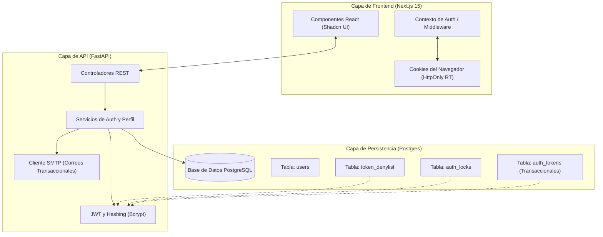

# PROYECTO: SimpleAuth - Documento de Arquitectura

> [!IMPORTANT]
> **Estado**: `Aprobado`  
> **Versión**: 1.5.0 (Final Architecture)  
> **Última Actualización**: 2026-04-01

## 1. Visión Arquitectónica (Diseño de 3 Capas)

SimpleAuth sigue una arquitectura desacoplada moderna que garantiza escalabilidad y seguridad.



### 1.1 Matriz de Responsabilidades
- **Frontend**: Gestiona la interacción del usuario, la validación de formularios (Zod), el almacenamiento seguro de indicadores de sesión (Access Token en memoria, Refresh Token en cookie HttpOnly) y la gestión dinámica de temas (Dark/Light mode) mediante `next-themes`.
- **Backend**: Aplica las reglas de negocio, gestiona el ciclo de vida de JWT, maneja la transmisión SMTP y ejecuta las transacciones de la base de datos.
- **Base de Datos**: Almacenamiento relacional con restricciones estrictas e índices para búsquedas de alta velocidad en campos únicos (email).

---

## 2. Esquema de Datos y Especificación DDL

### 2.1 Tablas Principales (SQLModel/Postgres)

#### Tabla: `users`
| Columna | Tipo | Restricciones | Descripción |
| :--- | :--- | :--- | :--- |
| `id` | UUID | PK, Default: uuid_v4 | Identificador único. |
| `email` | String | Único, Indexado | Identidad primaria (inmutable una vez verificado). |
| `password_hash` | String | Not Null | Contraseña hasheada con Bcrypt. |
| `first_name` | String | Not Null | Nombre. |
| `last_name` | String | Not Null | Apellido. |
| `birth_date` | Date | Not Null, CHECK | Edad >= 18. `CHECK (birth_date <= CURRENT_DATE - INTERVAL '18 years')`. |
| `gender` | Enum (`gender_type`) | Not Null | Restringido: {Masculino, Femenino, Otro}. |
| `country` | Enum (`country_type`) | Not Null | Lista restringida (CO, US, CA, MX, VE, Other). |
| `status` | Enum (`user_status`) | Default: `Pending` | Estado: {Pending, Active, Inactive}. |
| `created_at` | Timestamp | Default: now() | Fecha de creación. |
| `password_changed_at` | Timestamp | Default: now() | Usado para la revocación global de tokens. |
| `last_login_at` | Timestamp | Nullable | Último inicio de sesión. |
| `deleted_at` | Timestamp | Nullable | Inicio de la ventana de purga de 30 días. |

#### Tabla: `auth_locks` (Limitación de Tasa / Rate Limiting)
| Columna | Tipo | Restricciones | Descripción |
| :--- | :--- | :--- | :--- |
| `id` | Integer | PK | |
| `identifier` | String | Único, Indexado | Clave: `ip:email` o `ip:global`. |
| `attempts` | Integer | Default: 0 | Número de intentos fallidos consecutivos. |
| `locked_until` | Timestamp | Nullable | Tiempo de expiración del bloqueo (15 min). |

#### Tabla: `token_denylist` (Revocación de JWT)
| Columna | Tipo | Restricciones | Descripción |
| :--- | :--- | :--- | :--- |
| `jti` | String | PK | ID único del JWT. |
| `user_id` | UUID | FK -> users.id, Indexado | Usuario propietario de la sesión. |
| `revoked_at` | Timestamp | Nullable | Se establece cuando se invalida por RTR (ventana de 30s). |
| `expires_at` | Timestamp | Indexado | Tiempo para la limpieza automática de la entrada. |

#### Tabla: `auth_tokens` (Verificación y Restablecimiento de Contraseña)
| Columna | Tipo | Restricciones | Descripción |
| :--- | :--- | :--- | :--- |
| `id` | Integer | PK | |
| `user_id` | UUID | FK -> users.id, Indexado | |
| `token_hash` | String | Único, Indexado | Hash SHA-256 del token aleatorio (seguridad OTP). |
| `type` | Enum (`auth_token_type`) | Not Null | Tipo: {Verification, Reset}. |
| `expires_at` | Timestamp | Not Null | Validez predeterminada de 1 hora. |
| `used_at` | Timestamp | Nullable | Registra el uso único. |

### 2.2 Definición de Tipos Nativos (DDL)
- `CREATE TYPE user_status AS ENUM ('Pending', 'Active', 'Inactive');`
- `CREATE TYPE gender_type AS ENUM ('Masculino', 'Femenino', 'Otro');`
- `CREATE TYPE country_type AS ENUM ('CO', 'US', 'CA', 'MX', 'VE', 'Other');`
- `CREATE TYPE auth_token_type AS ENUM ('Verification', 'Reset');`

### 2.3 Estrategia de Migraciones
- **Herramienta**: **Alembic**.
- **Gestión**: Todas las actualizaciones de esquema (`users`, `auth_locks`, etc.) deben pasar por scripts de migración versionados.
- **Flujo**: `autogenerate` en desarrollo -> Revisión manual -> Aplicación en CI/CD antes del despliegue de la API.

---

## 3. Ciclo de Vida de Auth y Estrategia de Seguridad

### 3.1 Cifrado y Hasheo
- **Hasheo de Contraseñas**: Bcrypt (Factor de trabajo: 12).
- **Firma de JWT**: HS256 (Simétrico) usando una `SECRET_KEY` de alta entropía.

### 3.2 Estrategia de Tokens
1. **Access Token (JWT)**:
   - Vida útil: 1 hora.
   - Payload: `sub` (UUID del usuario), `exp`, `jti`, `iat`.
   - Transmisión: Encabezado de Autorización (`Bearer`).
2. **Refresh Token (RT)**:
   - Vida útil: 7 días.
   - Transmisión: Encabezado `Set-Cookie` (`HttpOnly`, `Secure`, `SameSite=Strict`).
   - Estrategia: **Rotación de Refresh Tokens (RTR)**. Cada vez que se usa un RT, el `jti` antiguo se incluye en la lista de denegación (`revoked_at = NOW()`) y se emite un nuevo par RT/AT.
   - **Periodo de Gracia de RTR**: Para evitar condiciones de carrera en peticiones concurrentes del cliente, un middleware verifica: `IF jti IN denylist AND revoked_at > (NOW() - INTERVAL '30 seconds') THEN Aceptar una sola vez`.

### 3.3 Lógica de Auth y Middlewares
- **Endpoint de Registro**: 
  - **Colisión en Pending**: Si existe un email con estado `Pending`, el sistema debe permitir sobrescribir el registro (Upsert) para corregir errores tipográficos o actualizar contraseñas antes de la verificación. Esto mantiene la restricción de `Único` cumpliendo con el Alcance F1.
  - **Conflicto en Inactive**: Si un email está como `Inactive`, el intento de registro debe ser bloqueado y la interfaz debe sugerir "Inicia sesión para reactivar tu cuenta".
- **Endpoint de Login**:
  - **Disparador de Reactivación**: Si un usuario está `Inactive` pero proporciona la **contraseña correcta**, el login se bloquea y el sistema dispara automáticamente un nuevo Correo de Verificación (Flujo de Reactivación) según el Alcance F5.
  - **Verificación de Estado**: Solo los usuarios `Active` pueden completar con éxito el inicio de sesión y recibir tokens.
- **Configuración de CORS**: Restringido a dominios específicos del frontend.
- **Protección CSRF**: 
  - Cookies usadas para el Refresh Token.
  - Mitigación: `SameSite=Strict` + **Cumplimiento de Encabezado Personalizado** (`X-CSRF-Token` o `X-Requested-With`) para todas las peticiones de mutación/refresco para asegurar que la llamada se origina desde la interfaz autorizada.
- **Revocación Global**: Al cambiar la contraseña, se actualiza `password_changed_at`. El middleware de verificación de JWT debe comprobar: `IF token.iat < user.password_changed_at THEN Rechazar`.
  - *Nota de Rendimiento*: El estado del usuario y `password_changed_at` se validan mediante una búsqueda en la base de datos durante la verificación del Access Token (Inyección de Dependencias en FastAPI).
- **Motor de Rate Limiting**:
  - Máximo 5 intentos por cada 15 minutos por identificador único (`ip:email`).
  - **Política de Reinicio**: En cualquier autenticación exitosa (Login/Refresh), el contador de `attempts` en `auth_locks` para ese identificador DEBE reiniciarse a 0.
  - Persistido en `auth_locks` para sobrevivir a reinicios del servidor.

### 3.4 Concurrencia y Sesiones
- **Límite de Sesiones**: Máximo de 5 cadenas de Refresh Tokens activas por usuario. Si se excede, el sistema revocará la sesión más antigua automáticamente.
- **Cierre Global**: Funcionalidad para revocar TODOS los Refresh Tokens de un usuario en el `token_denylist` (e.g., ante sospecha de compromiso), invalidando el acceso en todos los dispositivos de inmediato.

### 3.5 Observabilidad y Diagnóstico
- **Logging Estructurado**: Uso de logs JSON (FastAPI) incluyendo `timestamp`, `level`, `module` y `correlation_id`.
- **Middleware de Correlación**: Generación de un `X-Correlation-ID` por petición para rastrear flujos desde el Frontend hasta la base de datos.
- **Rastreo de Errores**: Integración con **Sentry** para captura de excepciones en tiempo real en los entornos de producción y staging.

---

## 4. Mantenimiento Operacional (CLI y Tareas)

#### 4.1 Mecanismo de Purga GDPR (Hard Delete)
La **Utilidad CLI Administrativa** (Docker Container: `api_service`) será orquestada mediante **GitHub Actions Self-Hosted Runners** o **Google Cloud Scheduler** (en producción):
- **Comando**: `docker exec api_service python manage.py purge-inactive`.
- **Query Interno**: `DELETE FROM users WHERE status = 'Inactive' AND deleted_at < (NOW() - INTERVAL '30 days')`.
- **Frecuencia**: Diaria (Cron: `0 0 * * *`).

### 4.2 Tarea de Limpieza (Higiene Automática)
Ejecutada cada 1 hora:
- **Purga de Pendientes**: `DELETE FROM users WHERE status = 'Pending' AND created_at < (NOW() - INTERVAL '1 hour')`. Esto libera correos de registros abandonados o con errores tipográficos.
- **Purga Transaccional**: `DELETE FROM auth_tokens WHERE expires_at < NOW() OR used_at IS NOT NULL`.
- **Purga de Denylist**: `DELETE FROM token_denylist WHERE expires_at < NOW()` para mantener la velocidad del índice.
- **Purga de Auth Locks**: `DELETE FROM auth_locks WHERE locked_until < (NOW() - INTERVAL '24 hours')`.

---

## 5. Despliegue e Infraestructura

- **Aislamiento de Entorno**: `.env.development` y `.env.production`.
- **Orquestación**: `docker-compose.yml` definiendo:
  - `gateway`: **Nginx/Traefik** para terminación SSL/TLS y Reverse Proxy.
  - `web`: Frontend Next.js.
  - `api`: Backend FastAPI.
  - `db`: Postgres 16.
- **Seguridad de Red**: La API y DB no se exponen directamente al puerto público; solo son accesibles a través del `gateway`.
- **Health Checks**: Endpoint `/health` para monitoreo de orquestación.

---

## 6. Contratos de Interfaz (API JSON Payloads)

### 6.1 Registro (`POST /auth/register`)
- **Request**:
  ```json
  {
    "email": "user@example.com",
    "password": "Password123!",
    "first_name": "Juan",
    "last_name": "Pérez",
    "birth_date": "1990-01-01",
    "gender": "Masculino",
    "country": "CO"
  }
  ```
- **Response (201 Created)**: `{"message": "Registration successful. Please check your email for verification.", "user_id": "uuid"}`

### 6.2 Inicio de Sesión (`POST /auth/login`)
- **Request**:
  ```json
  {
    "email": "user@example.com",
    "password": "Password123!"
  }
  ```
- **Response (200 OK)**: 
  - **Body**: `{"access_token": "jwt_here", "token_type": "Bearer"}`
  - **Cookie**: `refresh_token=jwt_here; HttpOnly; Secure; SameSite=Strict`

### 6.3 Refresco de Token (`POST /auth/refresh`)
- **Request**: (No body, lee `refresh_token` de Cookie)
- **Response (200 OK)**:
  - **Body**: `{"access_token": "new_jwt_here", "token_type": "Bearer"}`
  - **Cookie**: `refresh_token=new_rt_here; ...`

### 6.4 Contrato de Error Estándar
Todas las respuestas de error (4xx/5xx) seguirán esta estructura:
```json
{
  "error": {
    "code": "AUTH_EXPIRED_TOKEN",
    "message": "The session has expired. Please log in again.",
    "detail": "token_expired_jti_xyz",
    "correlation_id": "uuid-v4"
  }
}
```
