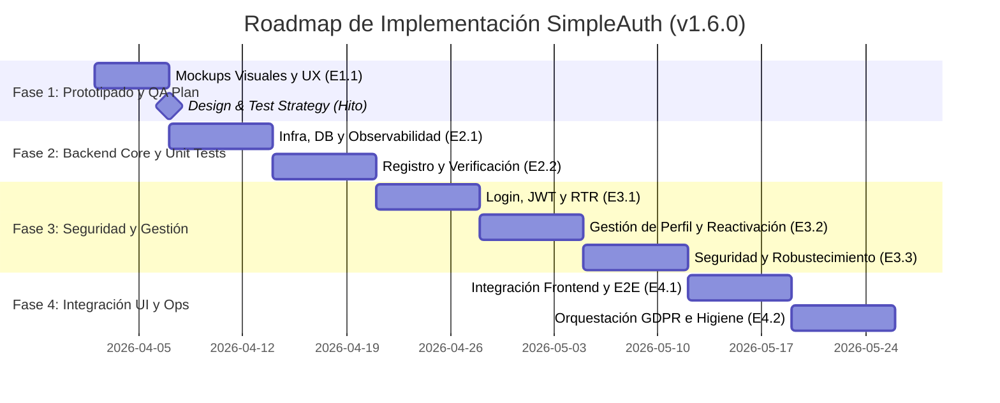

# PROJECT: SimpleAuth - Project Master Plan (PMP)

> [!IMPORTANT]
> **Status**: `Approved` (Post-Audit Resolution)
> **Version**: 1.6.0  
> **Last Updated**: 2026-04-01

## 1. Roadmap Overview
El plan maestro de SimpleAuth prioriza la validación temprana, una cimentación con observabilidad y una **estrategia de calidad continua (QA Automation)** para mitigar riesgos en los flujos de seguridad y cumplimiento legal.

---

## 2. Fase 1: Prototipado, UX y Estrategia de Pruebas
**Objetivo**: Validar el diseño y definir los criterios de aceptación técnica (QA) antes del código.

### Etapa 1.1: Mockups Visuales y UX
- **Alcance**: Diseño de alta fidelidad y definición del plan de pruebas de integración.
- **Entregables**:
    - Mockups de Registro, Login, Perfil y Recuperación.
    - **Documento de Estrategia de Pruebas (Test Plan)**: Definición de suites Unitarias, Integración y E2E.
    - Definición de Casos de Prueba (Criterios de Aceptación) por pantalla.
- **Agentes**: UI/UX Specialist, QA Lead.

---

## 3. Fase 2: Cimentación e Identidad (Backend Core & Unit Testing)
**Objetivo**: Establecer el entorno y el flujo de registro con validación automatizada.

### Etapa 2.1: Infraestructura, DB y Observabilidad
- **Alcance**: Configuración de Docker, FastAPI y telemetría.
- **Entregables**:
    - `docker-compose.yml` (Gateway, API + DB).
    - **Base de Pruebas**: Configuración de `pytest` con base de datos de test efímera.
    - Registro de Logs Estructurados y Sentry.
    - Migración 001 Alembic.
- **Agentes**: Coder (Backend), DevOps, QA (Unit Testing).

### Etapa 2.2: Registro y Verificación (Double Opt-in)
- **Alcance**: Backend de creación de cuentas y validación de correos.
- **Entregables**:
    - Endpoints `POST /auth/register` y `GET /auth/verify`.
    - **Suite de Pruebas Unitarias**: Validación de lógica de registro y expiración de tokens (1h).
    - Migración 002: Tabla `auth_tokens`.
- **Agentes**: Coder (Backend), QA.

---

## 4. Fase 3: Motor de Autenticación, Perfil y Seguridad (Integration Tests)
**Objetivo**: Implementar la lógica profunda y la gestión del usuario.

### Etapa 3.1: Login y Gestión de JWT (RTR)
- **Alcance**: Autenticación persistente y rotación de tokens.
- **Entregables**:
    - Endpoints `POST /auth/login` y `POST /auth/refresh`.
    - Lógica RTR con ventana de gracia de 30s.
    - **Lógica de Concurrencia**: Límite de 5 sesiones activas.
    - **Suite de Pruebas de Integración**: Pruebas de estrés para RTR y condiciones de carrera.
- **Agentes**: Coder (Backend), Security Auditor.

### Etapa 3.2: Gestión de Perfil y Reactivación de Cuentas
- **Alcance**: Endpoints de administración de usuario y recuperación de bajas.
- **Entregables**:
    - Endpoint `PATCH /users/me`: Actualización de perfil y cambio de contraseña.
    - **Invalidez de Tokens**: Lógica para invalidar sesiones al cambiar la contraseña (IAT vs password_changed_at).
    - **Flujo de Reactivación**: Lógica en login para disparar correo de verificación a usuarios `Inactive` con pass correcto.
    - **Suite de Pruebas**: Validación del ciclo de vida Inactivo -> Activo.
- **Agentes**: Coder (Backend), QA.

### Etapa 3.3: Seguridad y Robustecimiento
- **Alcance**: Protección contra ataques y recuperación.
- **Entregables**:
    - Rate Limiting (IP + Account) persistido en `auth_locks`.
    - Middlewares CSRF/CORS.
    - Flujo de Recuperación de Password (`POST /auth/recovery`).
    - **Auditoría de Seguridad**: Ejecución de tests de penetración básicos en API.
- **Agentes**: Coder (Backend), Security Auditor.

---

## 5. Fase 4: Integración UI, Operaciones e Higiene (E2E & Ops)
**Objetivo**: Consolidar el sistema, asegurar la higiene de datos y el cumplimiento GDPR.

### Etapa 4.1: Integración Frontend y E2E
- **Alcance**: Conexión UI-Backend y validación de flujos de usuario final.
- **Entregables**:
    - Auth Context para React con persistencia JWT.
    - Middleware de protección de rutas.
    - **Suite de Pruebas E2E (Playwright)**: Flujo completo Registro -> Verificación -> Login -> Perfil.
- **Agentes**: Coder (Frontend), QA Automation.

### Etapa 4.2: Orquestación GDPR e Higiene Automática
- **Alcance**: Gestión de bajas y mantenimiento de integridad.
- **Entregables**:
    - Funcionalidad de Soft Delete.
    - **Utilidad CLI `cleanup-hourly`**: Limpieza de registros `Pending` expirados (1h) y tokens/locks obsoletos.
    - **Utilidad CLI `purge-inactive`**: Hard Delete tras 30 días (GDPR).
    - **Orquestación (Cron/GHA)**: Programación de tareas horarias y diarias con monitoreo de éxito/error.
- **Agentes**: Coder (Backend), DevOps.

---

## 6. Riesgos y Mitigación
| Riesgo | Impacto | Mitigación |
| :--- | :--- | :--- |
| Deuda Técnica por falta de Tests | Alto | Cobertura obligatoria de Pytest (>80%) en cada etapa de backend. |
| Fallos en Reactivación | Medio | Casos de prueba específicos en la suite de Integración Fase 3.2. |
| Inconsistencia en Higiene | Medio | Logs detallados y alertas en Sentry para tareas programadas recurrentes. |

---

## 7. Cierre de Gobernanza
1. Emitir `plan_token.md` (v1.6.0 - AUTORIZADO).
2. Inicio de la Etapa 1.1 (Mockups + Test Strategy).
ORIZADO).
2. Inicio formal de la Etapa 1.1 (Mockups Visuales).
